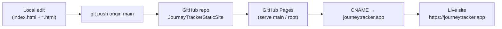
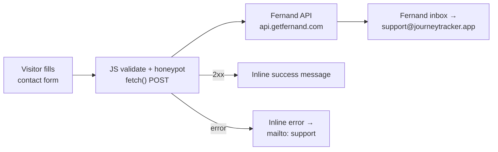

# Journey Tracker — Static Marketing Site

The marketing, support, and legal website for **Journey Tracker**, a native SwiftUI iPhone/iPad/Mac app for tracking GLP‑1 therapy, weight loss, lab results, body composition, hydration, and fasting. Pure static HTML/CSS/JS — no build step, no frameworks — deployed on GitHub Pages at **https://journeytracker.app**.

> **App status:** In development — Coming Soon to the Apple App Store. The hero CTA links to a waitlist signup (`waitlist.html`), not an App Store link.

---

## Deploy pipeline

GitHub Pages serves the repo root of the `main` branch directly. There is **no GitHub Actions workflow** — pushing to `main` is the deploy. The `CNAME` file (`journeytracker.app`) binds the custom domain.



Changes typically propagate in 1–3 minutes. Deploys from `main` only — no PR or Actions gate.

---

## Contact form flow

The contact form (in `#contact` on `index.html`) submits via a JavaScript `fetch()` POST to **Fernand** (`https://api.getfernand.com/messenger/contact`, slug `journey-tracker`). On a 2xx response the page shows an inline success message; on failure it shows an error pointing to the support mailbox. A honeypot field (`_gotcha`) silently drops bot submissions. A Fernand live‑chat widget (`messenger.getfernand.com/client.js`) also loads on every page.

> **Migration note:** the form previously used **Formspree** and **ImprovMX**. It now uses Fernand end to end (migrated in commit `380d21b`). The visitor's email becomes the Fernand conversation contact, so replying inside the inbox goes straight back to them.



---

## Site structure

```
JourneyTrackerStaticSite/
├── index.html               # Single-page marketing site (HTML + embedded CSS + vanilla JS)
├── waitlist.html            # Waitlist / "get notified at launch" signup
├── support.html             # Support page
├── privacy.html             # Full Privacy Policy
├── terms.html               # Full Terms of Service
├── hipaa.html               # HIPAA / health-information disclosure
├── health-data-privacy.html # Health-data privacy detail page
├── accessibility.html       # Accessibility statement (WCAG 2.1 AA / Section 508)
├── CNAME                    # Custom domain: journeytracker.app
├── robots.txt               # Allow all crawlers; references sitemap
├── sitemap.xml              # SEO sitemap
├── site.webmanifest         # PWA manifest + icons
├── favicon.* / *-chrome-*.png / apple-touch-icon.png  # Icon set
├── app-icon.jpg             # 1024×1024 app icon (OG/Twitter image, nav logo)
└── images/                  # Real in-app screenshots + chart/background assets
```

`.claude/`, `_dev/`, and `Docs/Roadmap.md` are gitignored (local-only).

### `index.html` sections

| Section | Anchor | Notes |
|---|---|---|
| Hero | `#home` | Tagline, "Join the Waitlist" CTA (orange), platform callout, hero screenshot |
| Walkthrough | `#walkthrough` | 4-step product story (nav labels this "Features") |
| Pricing | (in page) | Free tier vs. Journey Tracker Pro (monthly / annual / lifetime) |
| FAQs | `#faqs` | Accordion Q&A |
| Privacy & trust | `#privacy` | Plain-language summary; links to `privacy.html`, `hipaa.html`, `terms.html` |
| Contact | `#contact` | Fernand-powered form + `mailto:support@journeytracker.app` |
| Legal documents | `#documentation` | In-page accordions linking to the standalone legal pages |

---

## Technology

| Concern | Approach |
|---|---|
| HTML/CSS/JS | Semantic HTML5, embedded `<style>`, vanilla JS — no frameworks, no npm, no build |
| Contact form | `fetch()` POST to Fernand (`api.getfernand.com`); inline success/error; honeypot anti-spam |
| Live chat | Fernand messenger widget on every page (bottom-left) |
| Security | Strict `Content-Security-Policy` meta tag (self + `*.getfernand.com` only) |
| Fonts | System font stack (`-apple-system`, `system-ui`, …) |
| Responsive | Mobile-first; breakpoints at 768 px and 520 px |
| Accessibility | WCAG 2.1 AA / Section 508 — skip link, ARIA accordions, visible focus, reduced-motion |
| SEO | Meta + Open Graph + Twitter Card; JSON-LD (WebSite, Organization, SoftwareApplication, FAQPage); `robots.txt` + `sitemap.xml` |
| Performance | Hero image preloaded; `loading="lazy" decoding="async"` below the fold; `dns-prefetch` for Fernand |

---

## Local development

No build step. Serve the folder and open it in a browser:

```bash
# Recommended — matches the committed .claude/launch.json (port 8765)
python3 -m http.server 8765
# then visit http://localhost:8765

# Or open the file directly (form won't reach Fernand from file://)
open index.html
```

`.claude/launch.json` is preconfigured to launch the Python server on port 8765 via Claude Code's preview tooling.

> The contact form needs the live origin to reach Fernand; test form submission on the deployed site, not from `localhost`/`file://`.

---

## Deploying

1. Edit `index.html` (or any standalone page) and commit.
2. Push to `main` — GitHub Pages redeploys automatically.
3. Wait 1–3 minutes for propagation, then verify on https://journeytracker.app.

**Repository:** https://github.com/joemcmullin/JourneyTrackerStaticSite
**GitHub Pages source:** branch `main`, folder `/` (root). Custom domain via `CNAME`.

When updating screenshots, replace the file in `images/` using the **same lowercase, hyphenated filename** (GitHub Pages is case-sensitive Linux).

---

## Legal & compliance

This site provides the publicly accessible **Privacy Policy URL** and **Support URL** required for Apple App Store review. Journey Tracker is a consumer app and is **not** a HIPAA covered entity; `hipaa.html` and `health-data-privacy.html` explain that positioning and include the medical disclaimer.

---

## Contact

- **Support email:** support@journeytracker.app
- **App:** Journey Tracker — coming soon to the Apple App Store (iPhone · iPad · Mac)

*Journey Tracker does not provide medical advice. Always consult a qualified healthcare provider.*
